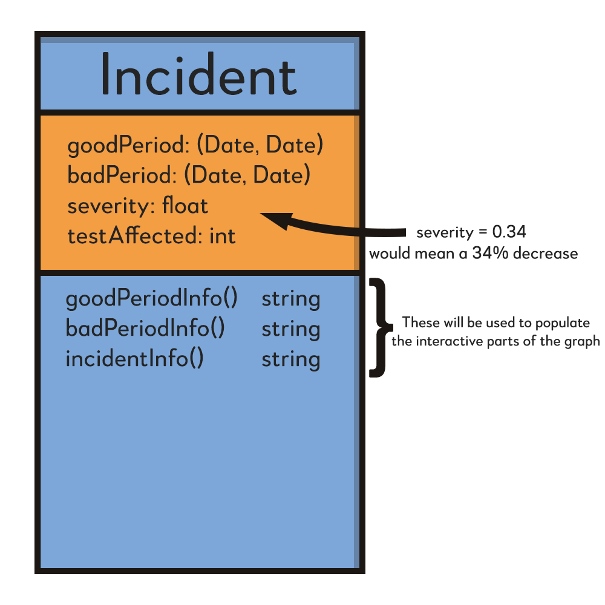

# Incident_Viewer_Demo
A demo of the Google M-Lab Incident Viewer created by HMC Clinic.
Basic mockup of demo:
  

This demo will showcase the Incident Viewer that we plan to implement into the viz.M-Lab site Spring Semester. We are using React to build it will be taking some components from the viz client repo. The purpose of making this demo separate from the client is to be able to build it quickly without running into compatibility problems with the larger system that the client code is in. That being said, we do not want to have to reimplement components like the graphs, so we will be taking that code from the client repo.

This demo will have access to a single, static incident object that it will display. When we implement this into the site, the Incident Viewer will be able to take in any incident object and display it.

# Incident Class and Incident Interface

For our demo, we create an Incident class that implements this interface. We plan on using the internet perforamance data currently sitting in the BigQuery, to leverage this class and make incidents. We will then pass these incidents to our front end, for them to be visualized.
Beyond the demo, we plan to document this interface so that arbitary incidents can be created and vizualized in the viz system will augement as long as they implement our interface.

* **goodPeriod** (Date startTime, Date endTime): This shows the duration of a good period in the internet performance date before an incident starts happening. A good period in this context can be defined as, for example, a year long period that is characterized by a healthy internet performance and is incident free.

* **badPeriod** (Date startTime,  Date endTime): This shows the duration of the incident period. For example, this could be a year long period characterized a 30 percent drop in internet download speed in a certain area relative to the previous year, which would be a good period in this example.

* **severity** float metric: This is a parameter to represent a metric that communicates how severe the incident is. This float is between 0.0 and 1.0 where 1.0 is the most severe incident of its type.

* **testAffected** int impactMetric: This shows the impact the incident has on internet users or internet infrastructure. This could be the number of user tests affected by the incident for example.

A UML class diagram of what an incident class object will look like:

  

Data for the Incident class will be fed in similarly to how it is fed in the M-Lab/Signal-Searcher repo. Specifically, we plan to draw from the main function in main.go.
